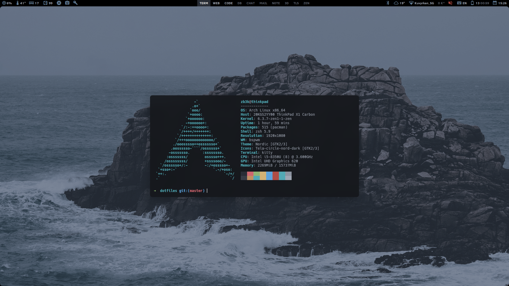

# Arch / bspwm / dotfiles

## Скриншоты



## Используемое ПО

`Arch` `bspwm` `polybar` `rofi` `dunst`

## Установка

```bash
git clone https://github.com/zb3k/dotfiles
cd dotfiles
./install.sh
```

## Приватные файлы конфигураций (deprecated)

Пример скрипта "**private/install.sh**":

```bash
#!/bin/bash

source '../functions.sh'

install_packages "packages/apps.txt"
install_dotfiles "dotfiles"
exec_script "postinstall.sh"
```

## Горячие клавиши

`wip...`

## GTK Themes

- https://github.com/EliverLara/Nordic (darker branch for gtk, master branch for kvantum)
- https://github.com/Templarian/MaterialDesign-Webfont
- https://github.com/vinceliuice/Tela-circle-icon-theme
